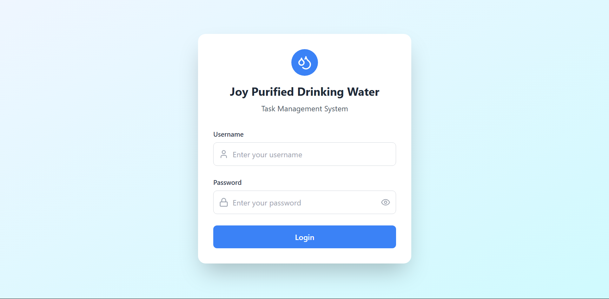
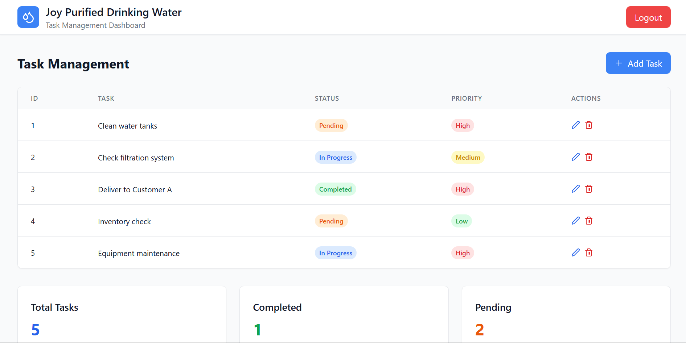

# Joy Purified Drinking Water - Task Management System

A simple React web application for managing tasks at a water refilling station.

## Screenshots

### Login Page


### Dashboard


## Features

- Login page with username/password
- Add, edit, and delete tasks
- View task status (Pending, In Progress, Completed)
- Set task priority (High, Medium, Low)
- Task counter dashboard

## Technologies Used

- React
- Tailwind CSS
- Lucide React (icons)

## Installation

1. Clone this repository
```bash
git clone https://github.com/rievldpns/joy-water-station.git
cd joy-water-station
```

2. Install dependencies
```bash
npm install
npm install lucide-react
npm install -D tailwindcss postcss autoprefixer
npx tailwindcss init -p
```

3. Configure Tailwind CSS in `tailwind.config.js`:
```javascript
module.exports = {
  content: ["./src/**/*.{js,jsx,ts,tsx}"],
  theme: { extend: {} },
  plugins: [],
}
```

4. Add Tailwind to `src/index.css`:
```css
@tailwind base;
@tailwind components;
@tailwind utilities;
```

5. Start the app
```bash
npm start
```

6. Open http://localhost:3000 in your browser

## How to Use

1. **Login**: Enter any username and password to access the system
2. **Add Task**: Click "Add Task" button and fill in the details
3. **Edit Task**: Click the pencil icon next to any task
4. **Delete Task**: Click the trash icon to remove a task